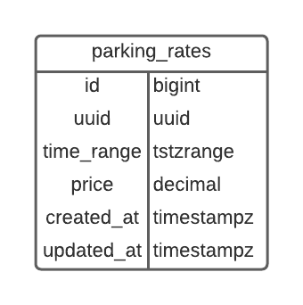
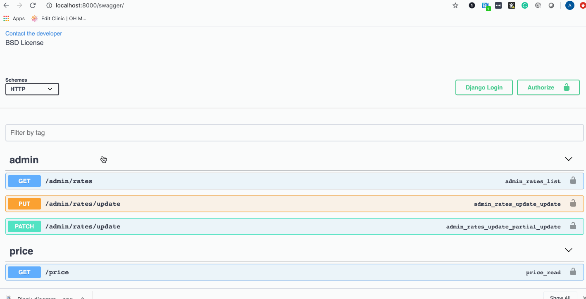

# SpotHero API

Parking rates and prices APIs

## Requirements

* Docker
* Docker Compose

## Setup instructions

```shell
git clone git@github.com:AtithAlur/sh-parking.git
cd sh-parking
docker-compose up --build
```

Application Root: http://localhost:8000
Swagger Docs: http://localhost:8000/swagger/

## Technologies

* Python - 3.9.4
* Django - 3.2
* Postgres

## Libraries

* Django>=3.0,<4.0
* psycopg2-binary>=2.8
* django-environ
* djangorestframework
* drf-yasg
* django-extensions
* flake8

## Database Design



## Table Description

* id - Auto incrementing unique Id for the table. This column is for internal use, for the foreign key relationships.
* uuid - Unique Id for external reference
* time_range - Time Range column to store the weekday time ranges. This is an efficient way to avoid overlaps and time-range queries.
* price - Decimal column to store prices. Limiting it to 10 digits with two precision
* created_at - Internal column to track table activities
* updated_at - Internal column to track table update activities

## Solution to storing parking rates

One of the critical problems in the application is to manage different parking rates at the given time range of a weekday.

* **Relational Table** - A simple solution could be to store weekday, start_at, and end_at information in separate columns. The problem with this approach is that we need some programming logic to identify overlaps and merge the overlapping rates. This solution is not scalable
* **Time Series Database** - Time series DB is meant to solve this kind of problem. They are good at storing timely data and very optimal in querying and indexing.

Since Postgres provides Time Range data type, I thought of using it. We can also get the benefits of relational DB.

## Approach

* I am converting all weekday and time inputs to a reference day that starts on Monday(2021-04-19T00:00:00-00:00).
* At the same time, I am converting to a UTC timezone.
* This conversion is applied to both storing rates and price queries.
* The unique index on the table's time_range column takes care of collisions.

Example Conversion:

Input:

```json
{
  "rates": [
   {
    "days" : "mon",
    "times": "0100-0200",
    "tz": "America/Chicago",
    "price": "200"
   }
  ]
}
```

time_range values:

```shell
'2021-04-19T06:00:00+00:00'
'2021-04-19T07:00:00+00:00'
```

## What could have done better?

* I am new to Python/Django; I could have chosen better libraries and frameworks. And, of course, better code
* I could have used a separate Time Series DB for better scalability
* I could have hosted the application with a Web and Application servers
* Logging configuration
* Monitoring and Metrics collection
* Better swagger documentation
* I could have hosted it on some AWS instance
* These are just a few things to mention.

## Demo

